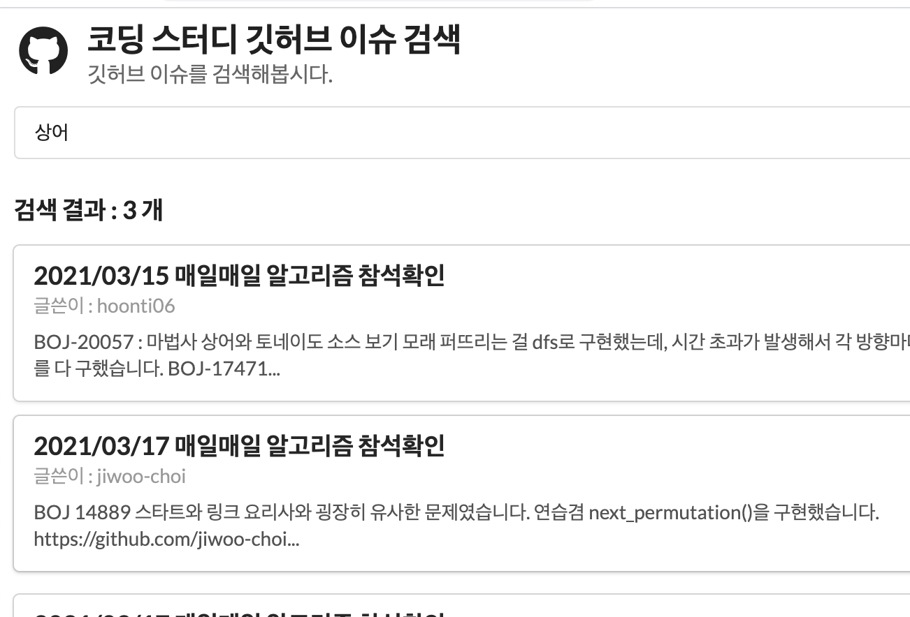

# Jiwoo-Choi-Resume

### 전체 Repositories
Github : https://github.com/jiwoo-choi?tab=repositories

## Projects
지금까지 진행해온 소규모 프로젝트들을 소개합니다.

### 코딩스터디 출석 체크 봇.
| 구분| 내용|
|--|--|
|기간| 21/01/23~ 현재까지 관리 중 |
|참여인원| 1명|

코딩스터디 url : https://github.com/jiwoo-choi/coding-study

코드 src url : https://github.com/jiwoo-choi/coding-study/tree/main/src

알고리즘 코딩 스터디의 출결관리를 체크하기 위해 Github Action을 통해 매일 이슈 생성 및 출결 관리 + 전체적인 데이터의 흐름을 typescript로 관리하도록 만들었습니다.

출결 데이터와 참석 데이터가 늘어나고 복잡해짐에 따라서, 편하게 사용할 수 있도록 **검색기와 차트** 등 점차 유저 편의성을 신경썼습니다.

언제든지 깃허브를 넘어서 다양하게 확장 가능한 코드가 될 수 있도록, 코드를 최근에 리팩토링 하였습니다.

- 사용기술 : Typescript, Github Action, Jest

### RxRedux
| 구분| 내용|
|--|--|
|기간| 20/07/15 ~ 20/07/29 (약 2주) |
|참여인원| 1명|

url: https://github.com/jiwoo-choi/RxRedux

코드상으로 자주 변하는 컴포넌트 UI 및 지역/전역 상태들을 Flux 흐름으로 추상화하여 테스팅을 할 수 있도록 만들어본 아키텍쳐입니다.

Redux처럼 Action, Reducer 등의 과정을 통해 상태를 수정하고, 그 과정의 흐름을 코드의 변화와 상관 없이 흐름을 기준으로 컴포넌트를 테스트하기를 원했습니다.

Rxjs를 통해서 비동기 UI 이벤트나 I/O 이벤트에 자연스럽게 대응하도록 의도하였습니다.

- [ReactorKit](https://github.com/ReactorKit/ReactorKit) 의 코드와 아이디어에서 영감 받았습니다.

- 사용기술 : Rxjs, Typescript

### R6 Community Front-end
| 구분| 내용|
|--|--|
|기간|20/07/15 ~ 프로젝트 중단 |
|참여인원| 2명|
|역할| 프론트엔드 |

레인보우 식스 시즈 게임 관련 커뮤니티 게시판 사이트입니다. 

기존 레인보우 식스 시즈 전적 검색 사이트와 연장선으로 제작한 프로젝트입니다.

- 언어 : TypeScript.
- 프론트앤드 프레임워크: React, 
- 테스트 : Jest
- 상태관리 프레임워크 : Mobx
- UI : Semantic UI React.

### Coin-Karaoke.
| 구분| 내용|
|--|--|
|기간|20/07/20~ 20/07/09 (약 2일간) |
|참여인원|1명|

유튜브 노래방 기능을 활용해 웹으로 노래방을 즐기는 서비스.

QR코드를 통해 현재 노래방서버를 소켓서버와 연결하여서 모바일에서 노래방 리모컨 서비스를 활용할 수 있습니다.

* Github (server) : https://github.com/jiwoo-choi/socket-coin-karaoke-server-side
* Github (front-end) : https://github.com/jiwoo-choi/coin-karaoke

- 프론트앤드: Typescript, React, Semantic UI.
- 백앤드: Node
- 소켓프로그래밍: Socket.io
- 호스팅 : AWS

### R6 Stats Front-end
| 구분| 내용|
|--|--|
|기간| 20/04/26 ~ 20/07/07 (약 2달) |
|참여인원| 2명|
|역할| 프론트엔드|

레인보우 식스 전적 검색 웹 사이트입니다.

* Website : http://r6-search.me/
* Github: https://github.com/jiwoo-choi/r6-stats-front-end/

- Front-end: React,Typescript, RxJs, Storybook, Jest.
- Back-end (목업서버용): Python3 Flask.

### Building React & React Native

UI/UX 코스 리액트, 리액트 네이티브 프로젝트 

* Github : https://github.com/jiwoo-choi/CS639-React
* Github : https://github.com/jiwoo-choi/CS639-React-Native-Project

## 📕 스터디
다양한 역량을 기르기 위해 스터디를 활발하게 참여하고 있습니다.

### 온라인 스터디

- Java 라이브 스터디 (종료)

자바의 기초에 해당하는 내용들을 많은 개발자들과 이야기를 나눌 수 있는 스터디.

* 개인 내용 정리 : https://www.notion.so/Java-4432e508deae46ec9f2ac2bdcc89d42f
* 스터디 리포지토리 : https://github.com/whiteship/live-study

- 알고리즘 스터디 (1월부터 운영중)
- 
매일 알고리즘 한개씩을 풀어 제출하고, 어떻게 풀었는지 상세 설명.

* Algorithm-online-study : https://github.com/jiwoo-choi/coding-study
 
 
- CS 온라인 스터디 (1월부터 운영중)

CS관련 지식들을 각자 공부하고 관련 주제에 대해서 배운점 토론 및 면접 준비.

* CS online-study : https://github.com/jiwoo-choi/cs-study

### 개별 스터디

- 핸즈온 프로젝트 (3월부터 시작)

디자인패턴, TDD, 이펙티브 자바, 구현 등 다양한 코딩프로젝트를 직접 해보면서 배웁니다.

- Hands on projects : https://github.com/jiwoo-choi/hands-on-coding-project

## Skills

- Framework & Libraries: react, vue.js, redux, mobx, rxjs, spring.
- Programming Language : java, javscript, typescript.
- 그 외 : git, babel, webpack, storybook.
